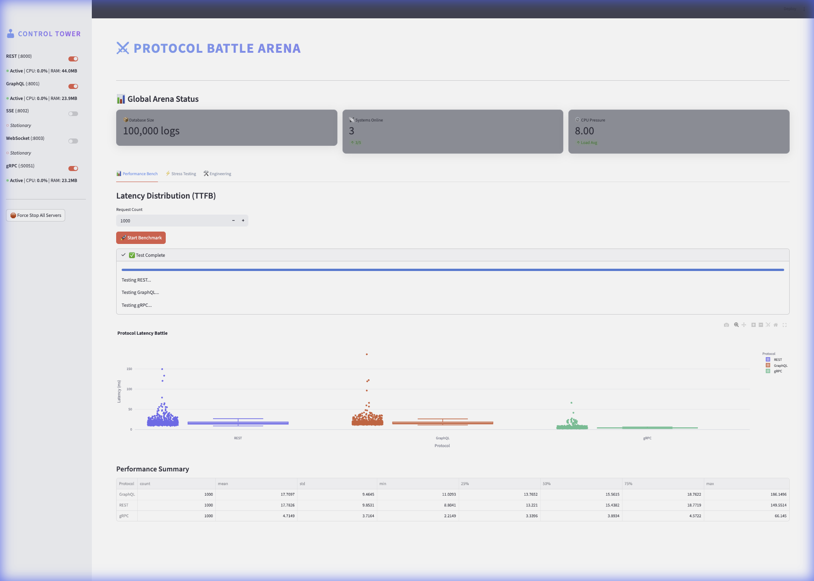
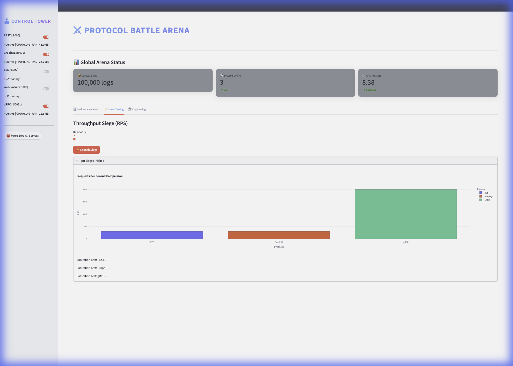
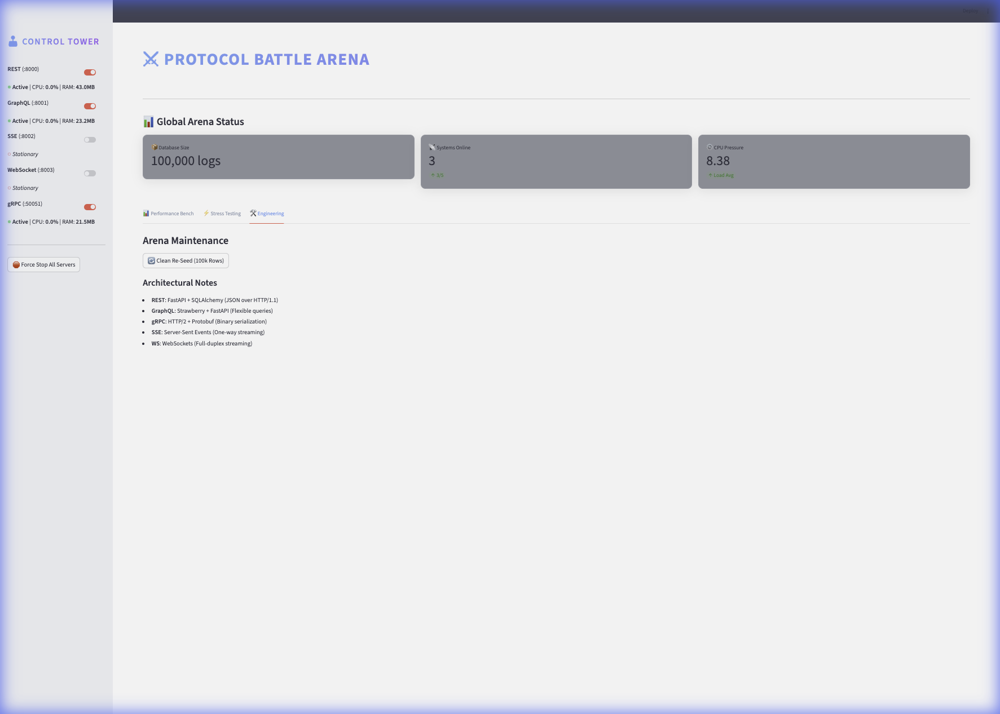

# ⚔️ Protocol Battle Arena

**An advanced, high-performance benchmarking suite for modern application protocols.**

The **Protocol Battle Arena** is a comprehensive lab designed to pit web protocols against each other in real-world scenarios. It features a professional-grade Streamlit dashboard, automated server orchestration, and deep performance analytics.



## 🚀 Quick Start

1. **Clone and Install**:
   ```bash
   git clone <repo-url>
   cd HandsOnWebProtocols
   uv sync
   ```

2. **Launch the Arena**:
   ```bash
   uv run streamlit run src/dashboard/app.py
   ```

---

## 🏗️ Core Architecture

### **The Control Tower**

Managed by a robust `ServerManager` singleton, the dashboard allows you to ignite or quench protocol servers with a single toggle.

- **Port-based Health Checks**: Automatic detection of server readiness.
- **Live Resource Tracking**: Real-time CPU and Memory (RSS) monitoring for every server process using `psutil`.
- **Fault-Tolerant Cleanup**: Integrated `pkill` and `lsof` logic to ensure no zombie processes remain.

### **The Data Layer**

Powered by an optimized SQLite database with **100,000+ records**.

- **Batch Seeding**: High-speed data generation via `src/scripts/generate.py`.
- **Indexed Queries**: Optimized for high-concurrency read operations during stress tests.

---

## 📡 Supported Protocols

| Protocol | Port | Implementation | Typical Use Case |
| :--- | :--- | :--- | :--- |
| **REST** | `8000` | FastAPI + SQLAlchemy | Standard internal/external APIs |
| **GraphQL** | `8001` | Strawberry + FastAPI | Flexible, sparse data fetching |
| **gRPC** | `50051` | Protobuf + HTTP/2 | High-performance microservices |
| **SSE** | `8002` | FastAPI Streaming | One-way real-time updates |
| **WebSockets** | `8003` | FastAPI WebSockets | Full-duplex interactive streams |

---

## 📊 Benchmarking Suite

### **1. Latency Distribution (TTFB)**

Measures **Time to First Byte** across sequential requests. Visualized using interactive Plotly box plots to show P50/P95 distribution and outliers.


### **2. Throughput Siege (RPS)**

A high-concurrency saturation test that hammers servers to find their breaking point.

- Integrated with `Siege` patterns.
- Live progress bars and dynamic bar charts.



---

## 🛠️ Advanced Usage & Engineering

### **Maintenance Controls**

The Engineering tab provides tools for database re-seeding and architectural insights.



### **Manual Data Generation**

To re-seed the arena with a specific row count:

```bash
PYTHONPATH=. uv run python src/scripts/generate.py
```

### **Running Tests**

```bash
uv run pytest tests/
```

### **Manual Server Control**

If you prefer the CLI:

```bash
# Start a specific server
PYTHONPATH=. uv run python src/servers/rest.py

# Force stop everything
pkill -f "src/servers"
```

---

## 🧪 Requirements

- **Python 3.12+**
- **uv** (Recommended for dependency management)
- **Siege** (Optional, for advanced throughput metrics)

---

*Built with ❤️ in the Protocol Battle Arena.*
